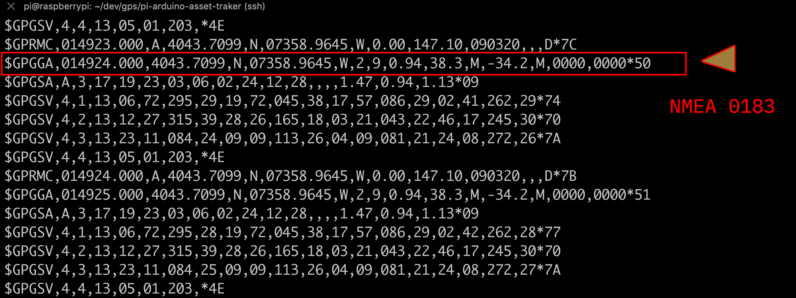

# Raspberry Pi with arduino 
## workup for an asset-tracker


Use Raspberry Pi to connect via usb to Arduino with Grove Shield and 
[Grove GPS sensor](http://wiki.seeedstudio.com/Grove-GPS/)


***Arduino Uno with Grove - Temerature/Barometer & GPS sensor attached***


Grove GPS writes via SoftSerial lib

```bash
screen /dev/ttyACM0 9600
```



The line starting with `$GPCCA` annotated above has the data that provides
the longitude and latitude and altitude data that is interesting to us.


Arduino talks to pi via usb 

[GPS.py lines 40 to 44](https://github.com/Grant-Steinfeld/pi-arduino-asset-traker/blob/master/gps.py#L40-L44) gets GPS and location information via the python library [pynmea](https://pypi.org/project/pynmea2/)

( $todo: add grab Temp, Humidity and Accelerometer data ... )


You will need to signup for Mapquest Developer account and get an API key

```bash
export MAPQUEST_KEY=hw26Ajxxxxxxxxxxx
```

in `python3 code gps.py` it will call 

Mapquest get url to

`http://www.mapquestapi.com/geocoding/v1/reverse?key=MAPQUESTKEY&location=40.72817333333333,-73.98259166666666&includeRoadMetadata=true&includeNearestIntersection=true`


and returns something similar to
```json
'nearestIntersection': {   'distanceMeters': '151.78865',
                            'label': 'E '
                                    '11th '
                                    'St '
                                    '& '
                                    'Avenue '
                                    'C',
                            'latLng': {   'latitude': 41.72785,
                                            'longitude': -73.982223},
                            'streetDisplayName': 'Avenue '
                                                'C'},
    'postalCode': '10009-4XXX',
    'sideOfStreet': 'L'
}

```

### resources

convert grove gps data to meanigful information
https://github.com/Knio/pynmea2

https://en.wikipedia.org/wiki/NMEA_0183

https://developer.mapquest.com/devblog/


